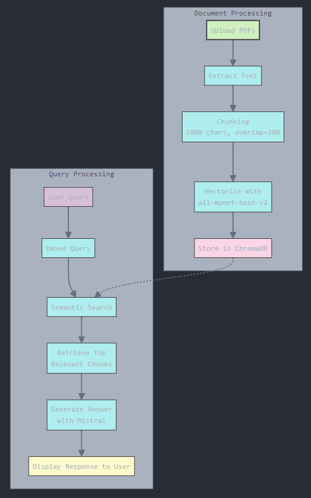

# 📄 PDF-Bot - AI-Powered PDF Assistant

An **AI-powered chatbot** that enables users to query PDFs using **Ollama (Mistral)** and **ChromaDB**. Ideal for researchers, students, and professionals looking for quick insights from documents.

 
---

## 🌟 Features
✅ **Extract Key Information** from PDFs
✅ **Semantic Search** using ChromaDB
✅ **Multi-PDF Processing**
✅ **Conversational Memory** (Retains Chat Context)
✅ **User-Friendly Interface** with Streamlit
✅ **Fast and Efficient Query Resolution**

---

## 🛠️ Tech Stack
- **Backend:** Python, LangChain, Ollama (Mistral)
- **Vector Database:** ChromaDB
- **Embeddings:** Sentence Transformers (`all-mpnet-base-v2`)
- **Frontend:** Streamlit UI

---

## 📥 Installation
### 1️⃣ Clone the Repository
```bash
git clone https://github.com/Kameshwaran-45/PDF-Bot.git
cd PDF-Bot
```

### 2️⃣ Install Dependencies
```bash
pip install -r requirements.txt
```

### 3️⃣ Run Ollama (for Mistral LLM)
```bash
ollama pull mistral
```

### 4️⃣ Start the Application
```bash
streamlit run app.py
```

---

### **Workflow Overview:**
1. **Upload PDFs**: The user uploads one or more PDFs.
2. **Text Processing**: Extracts text and splits it into smaller chunks.
3. **Vectorization**: Converts text into numerical embeddings for efficient retrieval.
4. **Query Handling**:
   - User asks a question.
   - The question is embedded and compared with stored vectors.
   - The most relevant chunks are retrieved.
5. **Answer Generation**: The Mistral model generates a response using retrieved context.

---

## 🚀 Usage
1. **Upload a PDF** via the Streamlit sidebar.
2. Click on **Process Documents** to index the file.
3. Ask **natural language questions** such as:
   - _"What are the key findings?"_
   - _"Summarize page 5."_
   - _"List all references cited."_

---

## 📜 License
MIT © [Kameshwaran](https://github.com/Kameshwaran-45)

---

## 📌 To-Do
✅ Add **support for multiple file formats (DOCX, TXT, etc.)**
✅ Improve **query relevance ranking**
✅ Deploy using **Docker & Hugging Face Spaces**
✅ Add **authentication for secure access**

📢 **Contributions Welcome!** Feel free to fork, submit PRs, or raise issues!

